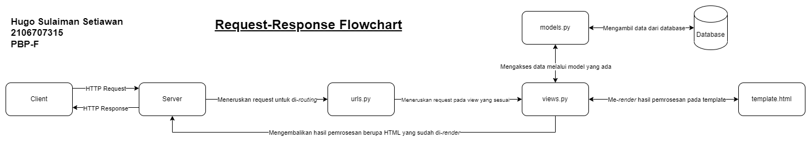

# Tugas Individu 2 PBP
**Hugo Sulaiman Setiawan (2106707315)**

## URL aplikasi pada Heroku
[https://pbp-tugas-hugo.herokuapp.com/katalog/](https://pbp-tugas-hugo.herokuapp.com/katalog/)

## Bagan *request-response*


## Mengapa menggunakan *Virtual Environment* / ```venv```?
*Virtual environment* digunakan untuk membuat suatu *environment* virtual yang terpisah dari *environment* yang utama dan venv-venv lainnya. Virtual environment digunakan untuk memisahkan *dependency* yang mungkin saja berbeda dari satu proyek ke proyek yang lainnya.  

Tanpa penggunaan venv, kemungkinan besar akan terjadi konflik atas *dependency*-*dependency* suatu proyek dengan proyek lainnya. Misal, jika proyek Z memiliki *dependency* modul A versi 1, sedangkan proyek B memiliki *dependency* modul Z versi 1.1, namun pada *environment* yang utama terinstal modul Z dengan versi 0.8, maka untuk memastikan tiap proyek memiliki *dependency* dan versi yang sesuai, proyek-proyek tersebut dijalankan dalam venv yang terpisah dan digunakan oleh proyek tersebut saja. 

## Penjelasan implementasi
### Fungsi pada ```views.py```
Pada tugas 2 ini, saya mengimplementasikan fungsi ```show_katalog(request)``` untuk mengambil seluruh data yang ada pada model ```CatalogItem```, memasukkan beberapa data seperti nama dan NPM, serta me-*render* data-data tersebut pada template ```katalog.html```. 
### *Routing* pada ```urls.py``` untuk memetakan fungsi
Pada file ini (baik pada folder katalog maupun pada *root directory*), saya menambahkan ```urlpatterns``` yang bertujuan untuk memetakan *request* pada path tertentu (```/katalog```) ke fungsi ```show_katalog(request)``` yang sudah dibuat sebelumnya pada ```views.py```.
### Memetakan data ke template ```katalog.html```
Pada file ini, saya menambahkan beberapa Django *template tags* yang sesuai agar data yang diambil dapat di-*render* pada tabel di template dengan benar.
### Melakukan *deployment* ke Heroku
Setelah melakukan langkah-langkah di atas, saya membuat app pada Heroku, kemudian memasukkan nama app tersebut (```HEROKU_APP_NAME```) serta API key saya (```HEROKU_API_KEY```) ke dalam *actions secrets* pada repositori GitHub saya. Setelah itu, saya melakukan *commit* dan *push* sehingga perubahan pada repositori lokal akan tercermin pada GitHub, serta *actions* akan berjalan untuk mendeploy aplikasi ke Heroku.