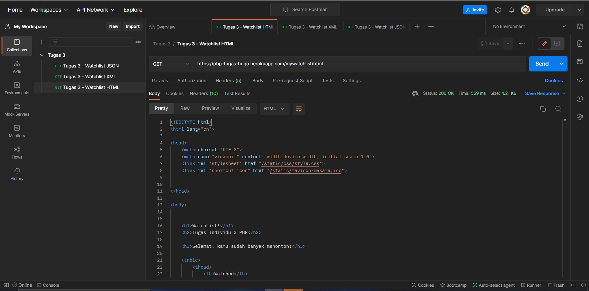
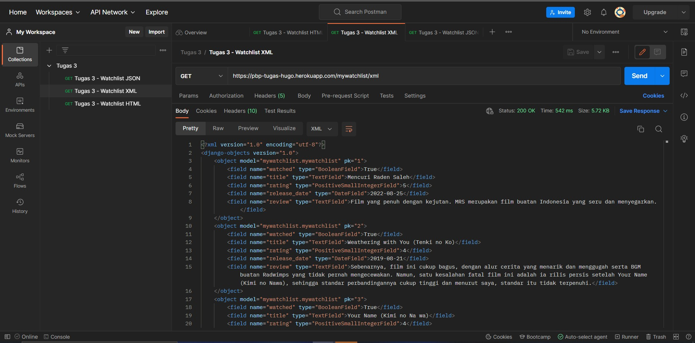
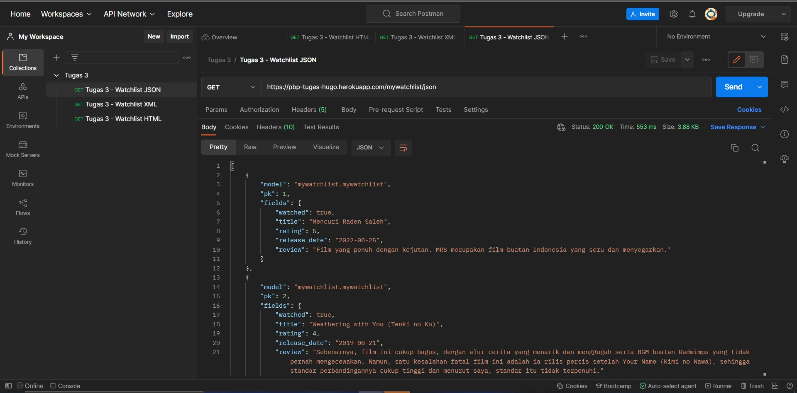

# Tugas Individu 3 PBP
**Hugo Sulaiman Setiawan (2106707315)**

## URL aplikasi pada Heroku
https://pbp-tugas-hugo.herokuapp.com/mywatchlist/
- [HTML](https://pbp-tugas-hugo.herokuapp.com/mywatchlist/html/)
- [XML](https://pbp-tugas-hugo.herokuapp.com/mywatchlist/xml/)
- [JSON](https://pbp-tugas-hugo.herokuapp.com/mywatchlist/json/)

## Perbedaan HTML, XML, dan JSON
- HTML (*HyperText Markup Language*) merupakan bahasa yang dapat **menyajikan dokumen/data dalam bentuk halaman web yang ditampilkan oleh browser**. Dengan menggunakan HTML, sebuah developer dapat juga menggunakan CSS untuk memberikan *styling*, serta JS untuk keperluan *scripting*. Selain itu, manipulasi terhadap halaman web dapat dilakukan melalui HTML *Document Object Model* (DOM) yang bersifat hierarkis.
- XML (*eXtensible Markup Language*) **merupakan bahasa yang merepresentasikan data melalui penggunaan *tag*-*tag*** (seperti misalnya tag `<field>`). Penggunaan *tag*-*tag* membuatnya secara sekilas mirip dengan HTML. Bahkan, pada XML juga terdapat struktur hierarkis serta konsep DOM yang dapat digunakan untuk mengakses serta memanipulasi data. Namun, tujuan dari HTML (menyajikan dalam bentuk halaman web) pun berbeda dengan XML. Di samping itu, tag-tag pada HTML (seperti `<head>`, `<div>`) sudah didefinisikan dalam standar, sedangkan pada XML tag-tag dapat didefinisikan melalui *schema*.
- JSON (*JavaScript Object Notation*) merupakan notasi yang digunakan untuk merepresentasikan obyek-obyek. JSON disebut sebagai *JavaScript Object Notation* karena pada awalnya, JSON memang digunakan untuk merepresentasikan objek dalam JavaScript. Jika HTML dan XML didasari pada konsep DOM, maka JSON didasari pada konsep *key-value pair*, atau pasangan kunci dan nilai (seperti misal `{"kode_matkul": "CSGE602022"}`).  

## Mengapa *data delivery* diperlukan dalam implementasi suatu platform?
*Data delivery* diperlukan dalam suatu platform karena suatu aplikasi tentu perlu untuk mengambil atau menaruh data tertentu pada server, maupun layanan lainnya. Tanpa adanaya *data delivery*, aplikasi-aplikasi akan terasa dan bersifat "statik" karena data yang terdapat didalamnya tidak berubah sesuai dengan kondisi yang ada. Selain itu, *data delivery* diperlukan untuk memungkinkan pengalaman *cross-platform* yang konsisten. Tanpa *data delivery*, bisa saja terjadi keinkonsistenan data antar-platform.

## Penjelasan implementasi
### Pembuatan app `mywatchlist`
Pertama-tama, app `mywatchlist` dibuat dengan perintah `startapp mywatchlist` pada `manage.py`.
### Model `MyWatchList` pada ```models.py```
Untuk tugas ini, saya menambahkan model `MyWatchList` sesuai dengan ketentuan yang telah diberikan pada dokumen soal melalui implementasi pada `models.py` sebagai berikut:
```py
class MyWatchList(models.Model):
    watched = models.BooleanField()
    title = models.TextField()
    rating = models.PositiveSmallIntegerField()
    release_date = models.DateField()
    review = models.TextField()
```
Setelah menambahkan model tersebut, saya menambahkan *fixture* sebagai data, serta melakukan `makemigrations`, `migrate`, dan `loaddata` agar model tersebut dapat tercermin pada *database* serta terisi dengan data yang telah dibuat sebelumnya. 

### *Views* pada ```views.py```
Untuk mengakses data pada *database*, baik dalam bentuk HTML, XML, maupun JSON, dibuat beberapa *view* sebagai berikut:
```py
def show_watchlist_html(request):
    data_watchlist = MyWatchList.objects.all()
    watchlist_message = ""

    if (MyWatchList.objects.filter(watched=True).count() >= MyWatchList.objects.filter(watched=False).count()):
        watchlist_message = "Selamat, kamu sudah banyak menonton!"
    else:
        watchlist_message = "Wah, kamu masih sedikit menonton!"

    context = {
        "watchlist": data_watchlist,
        "watchlist_message": watchlist_message,
    }

    return render(request, "watchlist.html", context)

def get_watchlist_xml(request):
    data_watchlist = MyWatchList.objects.all()
    return HttpResponse(serializers.serialize("xml", data_watchlist), content_type="application/xml")

def get_watchlist_json(request):
    data_watchlist = MyWatchList.objects.all()
    return HttpResponse(serializers.serialize("json", data_watchlist), content_type="application/json")
```
Untuk view XML dan JSON, data dari model diteruskan kepada *serializer* untuk diproses sesuai dengan format yang ditentukan. Sedangkan, untuk view HTML, terdapat pemrosesan terlebih dahulu untuk menentukan pesan yang akan ditampilkan, kemudian keseluruhan *context* akan diberikan kepada fungsi `render()` untuk di-*render* pada template untuk kemudian dikembalikan kepada *client*.

### Memetakan data ke template ```watchlist.html```
Pada file ini, saya menambahkan beberapa Django *template tags* yang sesuai agar data yang diambil dapat di-*render* pada tabel di template dengan benar.

### *Routing* pada ```urls.py``` untuk memetakan fungsi
Pada file `urls.py`, baik pada *root directory* maupun pada direktori untuk app, saya menambahkan ```urlpatterns``` yang bertujuan untuk memetakan *request* pada path tertentu (```/mywatchlist/*```) ke fungsi yang sesuai pada ```views.py```. Misal, jika *path* yang diminta adalah `/mywatchlist/json`, maka fungsi pada `views.py` yang akan dipanggil adalah `get_watchlist_json()`. 

### *Unit tests* pada ```tests.py```
Untuk melakukan *test* terhadap app yang baru saja dibuat, saya menambahkan beberapa *test* dalam file `tests.py` yang sudah dibuat secara otomatis saat `startapp`. Test tersebut adalah sebagai berikut:  
```py
class MyWatchlistAppTest(TestCase):
    def test_watchlist_html_response_ok(self):
        response = Client().get("/mywatchlist/html/")
        self.assertEqual(response.status_code, 200)

    def test_watchlist_xml_response_ok(self):
        response = Client().get("/mywatchlist/xml/")
        self.assertEqual(response.status_code, 200)

    def test_watchlist_json_response_ok(self):
        response = Client().get("/mywatchlist/json/")
        self.assertEqual(response.status_code, 200)
```
Test tersebut mengecek apakah tiap *path / endpoint* mengembalikan respons dengan kode `200 OK` kepada *client*.

### Melakukan *deployment* ke Heroku
Setelah melakukan langkah-langkah di atas, saya membuat app pada Heroku, kemudian memasukkan nama app tersebut (```HEROKU_APP_NAME```) serta API key saya (```HEROKU_API_KEY```) ke dalam *actions secrets* pada repositori GitHub saya. Setelah itu, saya melakukan *commit* dan *push* sehingga perubahan pada repositori lokal akan tercermin pada GitHub, serta *actions* akan berjalan untuk mendeploy aplikasi ke Heroku.

## Screenshot akses URL via Postman
### HTML

### XML

### JSON
